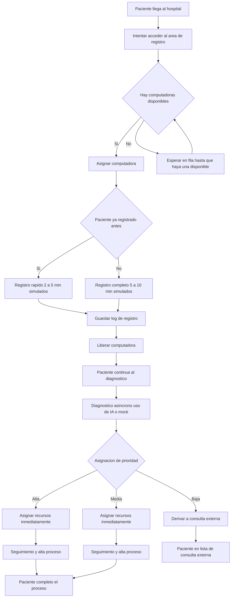

# Estructura del proyecto hospital_sim

Para el funcionamiento de esta simlacion se estara tomando una reduccion de tiempo simulando que un segundo es quivalente a 10 minutos

<h1 style='text-align: center;'>
    1 segundo = 10 minutos
</h1>

La estructura dada al proyecto sera en modulos de la siguiente forma:

```bash
hospital/
├── .venv/                     # Entorno virtual de Python
├── data/                      # Módulo principal del sistema
│   ├── pacientes.py           # Conjunto de pacientes
├── diagnostico_ia.py      # Funcion de diagnostico con OpenIA
├── diagnostico_mock.py    # Diagnóstico simulado para pruebas
├── logger_datos.py        # Registro de eventos en archivos CSV
├── main.py                # Ejecuta el flujo de la simulación
├── paciente.py            # Clase Paciente (estructura de persona real) 
├── recursos.py            # Asignación de camas, doctores, etc.
├── registro.py            # Flujo de registro de un paciente
├── seguimiento.py         # Seguimiento y alta de pacientes
└── README.md                  # Documentación del proyecto
```

La estructura de un paciente fue dada de forma personal, ya que sus registros seran guardados en un csv, por lo tanto un paciente tiene la siguiente estructura:

```python
class Paciente:
    id: str = field(default_factory=lambda: str(uuid4()))
    nombre: str
    genero: str
    edad: int
    raza: str
    altura: float
    peso: float
    habitos_alimenticios: str
    antecedentes_medicos: List[str]
    registrado: bool = False
```

El flujo de un paciente estaradedfinido por lo siguiente:

