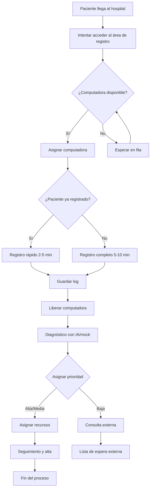

# Simulación de un Sistema Hospitalario Distribuido

Este proyecto simula un sistema automatizado de atención hospitalaria en urgencias, con el objetivo de aplicar paradigmas de programación **concurrente**, **paralela** y **asíncrona**, modelando un flujo realista de pacientes que llegan a un hospital y deben pasar por diversas etapas hasta su alta médica.

---

## Instrucciones de ejecución

Asegúrate de tener todas las dependencias instaladas (por ejemplo, `pandas` si se usa para logs). Luego, ejecuta la simulación con:

```bash
python main.py
```

Este script:
- Generará los pacientes.
- Iniciará el flujo completo de registro, diagnóstico y seguimiento.
- Mostrará logs en consola.
- Guardará los eventos en archivos CSV.

Puedes modificar el número de pacientes o el tipo de diagnóstico dentro de `main.py` según necesites.

---

## Objetivo

Modelar la atención a pacientes en un entorno hospitalario simulado, permitiendo:

- Registro concurrente de múltiples pacientes.
- Diagnóstico automático con IA (o simulación).
- Asignación de recursos (camas, doctores).
- Seguimiento hasta el alta médica.

La simulación considera tiempos variados, prioridades y ejecución en paralelo o asincrónica de procesos según su naturaleza.

---

## Tecnologías y herramientas

- **Lenguaje:** Python 3.11+
- **Concurrencia:** `threading`, `queue`
- **Paralelismo:** `multiprocessing`
- **Asincronía:** `asyncio`, `aiohttp` (si se usa API real)
- **IA (opcional):** `openai` o simulación (`diagnostico_mock.py`)
- **Registro de eventos:** `pandas`, `csv`
- **UUIDs únicos:** `uuid`
- **Tiempos simulados:** `1 segundo = 10 minutos reales`

---

## Estructura del Proyecto

```bash
hospital/
├── data/
│   └── pacientes.py           # Generación y carga de pacientes
│   └── paciente.py           # Clase Paciente
├── diagnostico_ia.py         # Diagnóstico con modelo de IA
├── diagnostico_mock.py       # Diagnóstico simulado
├── logger_datos.py           # Registro en CSV de eventos
├── main.py                   # Punto de entrada de la simulación
├── recursos.py               # Gestión de camas, doctores
├── registro.py               # Flujo de registro del paciente
├── seguimiento.py            # Proceso de seguimiento y alta
└── README.md                 # Este archivo
```

---

## Flujo de un Paciente



---

## Uso de paradigmas

| Componente            | Paradigma usado       | Justificación |
|-----------------------|-----------------------|----------------|
| Registro de pacientes | Concurrencia (`threading`) | Múltiples pacientes pueden registrarse al mismo tiempo, con control de acceso a recursos (computadoras). |
| Diagnóstico           | Asincronía (`asyncio`) | Se ejecuta un `diagnosticar(paciente)` asíncrono. |
| Seguimiento y alta    | Paralelismo (`multiprocessing`) | Pacientes con prioridad Alta o Media son procesados en procesos independientes. |

---

## Configuración del Diagnóstico

Puedes alternar entre el uso de IA real o un diagnóstico simulado modificando la variable `MODO_DIAGNOSTICO` al inicio de `main.py`:

```python
MODO_DIAGNOSTICO = "ia"  # o "mock"
```

- `"ia"` → Usa `diagnostico_ia.py`, que puede invocar un modelo real vía API.
- `"mock"` → Usa `diagnostico_mock.py`, simulando tiempos de respuesta aleatorios y resultados ficticios.

---

## Paralelismo y concurrencia

| Etapa                   | Técnica utilizada        | Detalles |
|-------------------------|--------------------------|---------|
| Flujo general por paciente | `threading.Thread`       | Cada paciente es atendido en un hilo separado. |
| Diagnóstico             | `asyncio`                | Se ejecuta un diagnóstico asíncrono. |
| Seguimiento y alta      | `multiprocessing.Process`| Proceso independiente por paciente. |

---

## Documentación del módulo de registro

El módulo de registro gestiona el acceso de los pacientes al sistema hospitalario controlando el uso de computadoras compartidas mediante concurrencia con `threading` y `semaforos`.

### Código explicado: `registrar_paciente(paciente)`

- **Objetivo:** Simular el proceso de registro de un paciente, considerando si es nuevo o recurrente.
- **Control de concurrencia:** Se usa un `BoundedSemaphore(5)` para limitar el acceso simultáneo a 5 computadoras.
- **Cola de recursos:** `Queue()` mantiene el control de computadoras disponibles (del 1 al 5).
- **Duración:**
  - Registro **rápido** (paciente recurrente): 2 a 5 minutos simulados.
  - Registro **completo** (paciente nuevo): 5 a 10 minutos simulados.
- **Tiempos:** Se usan timestamps para calcular:
  - Tiempo de espera antes de acceder a una computadora.
  - Duración del registro.
- **Logs:** Cada registro exitoso guarda un log CSV con los datos: nombre, horas, espera, duración y computadora asignada.

---


### Diagnóstico simulado (`diagnostico_mock.py`)

Este módulo actúa como una alternativa sin conexión al sistema de diagnóstico con IA. Su función principal es simular el comportamiento de un modelo de IA generando un diagnóstico aleatorio, una prioridad (Alta, Media o Baja), y una recomendación basada en lógica ficticia. Utiliza `asyncio.sleep()` para imitar el tiempo de espera de una respuesta remota (entre 1 y 3 segundos simulados). Es útil para pruebas, entornos sin internet o evitar consumo de tokens en la API real.

### Diagnóstico con IA (`diagnostico_ia.py`)

Este módulo implementa un diagnóstico clínico preliminar utilizando la API de OpenAI con asincronía mediante `asyncio`. Realiza las siguientes acciones:

- **Inicio:** Registra la hora de inicio y muestra en consola que el paciente está en diagnóstico.
- **Prompt:** Crea un mensaje personalizado con los datos del paciente (nombre, edad, género, raza, altura, peso, hábitos y síntomas) para generar un diagnóstico profesional.
- **API:** Llama al modelo `gpt-3.5-turbo` de OpenAI y espera una respuesta con `await client.chat.completions.create(...)`.
- **Procesamiento:** Interpreta la respuesta de IA, extrae el texto y deduce la prioridad (buscando las palabras "Alta", "Media" o "Baja").
- **Resultado:** Devuelve un diccionario con los datos relevantes del diagnóstico: nombre, hora de inicio y fin, duración, texto del diagnóstico y prioridad.
- **Errores:** En caso de excepción, devuelve un diagnóstico de error por defecto con prioridad "Media".

